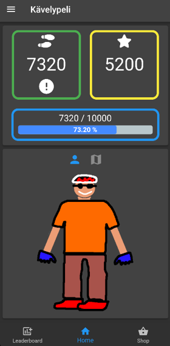

# Kävelypeli
This project has been implemented by the second-year students of the Information technology degree program at Oulu University of Applied Sciences. This application measures and displays steps in a fun way and encourages especially young people to move. The user can, for example, collect points, buy accessories for the character, unlock achievements, and monitor the activity of friends.

## Features
-	User authentication and profile creation
-	Real-time step tracking
-	In-game shop and achievements
-	Leaderboard

## Installation
1.	Install Flutter on your computer by following the instructions on the [official Flutter website]( https://docs.flutter.dev/get-started/install).
2.	Clone this repository to your local machine.
3.	Run `flutter pub get` to install the required dependencies.
4.	Connect your Android or iOS device to your computer and enable USB debugging.
5.	Run `flutter run` to build and install the app on your device.

## Project Members

Efforts were made to distribute the tasks contained in the different areas of the project as evenly as possible among all participants. Each contributor of the project worked as a full stack developer, participating in every phase of the project.

Olli Petäjäniemi, [Github](https://github.com/petajaol) 
 Johannes Rantapää, [Github](https://github.com/Necromunda)
 Saku Suorajärvi, [Github](https://github.com/Sakuss)
 Aaro Putto, [Github](https://github.com/aaroputto)
 Teea Põldsam, [Github](https://github.com/tpoldsam)
